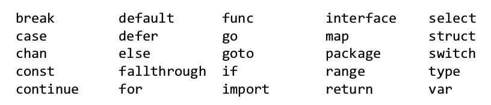
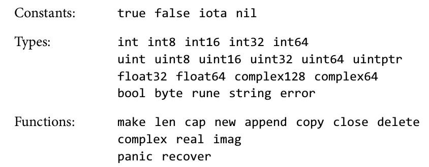
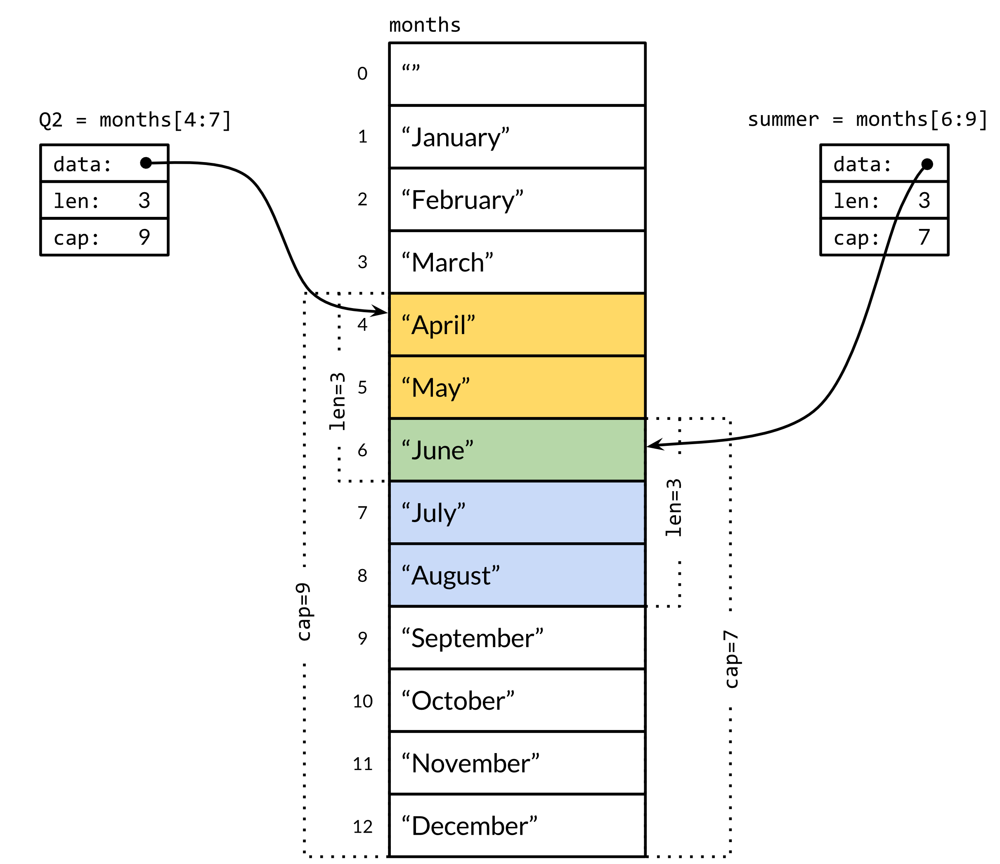

# Go 入门指南

---

## 关键特性

* 开发快
* 运行快
* 高并发
* 易学习

---

## 开发快

* 强大的库支持
* 编译快（模块机制）
* 易分析、易调试（静态类型）
* 易布署（静态链接，最小化依赖）


## 运行快

* 直接编译为本地代码，类似C/C++
	* （ELF on Unix/PE on Windows）

## 高并发

* 语法级别的 协程(goroutine)/管道(channel) 支持

---

## 易学习

* 自带GC（无内存泄漏）
* 没有class
	* 没有继承、多态(OOP, Object-Orentied Programming)
	* 有struct
		* 支持抽象(abstraction)
		* 支持封装(encapsulation)
	* 有method (Object-Based)
* 没有template，没有泛型编程（GP, Generic Programming）
	* 有interface

---

## 内容概要

* 变量
* 基本类型
* 控制结构
* 函数 func
* 协程 goroutine
* 管道 channel
* 包 package
* 复合类型
* 结构 struct
* 方法 method
* 接口 interface

---

## 变量 = 名称 + 类型 [+ 初始值]

```go
var i int     // declare but not assigned, 0 by default
var j int = 1 // declare and assigned

// infer type by value
var isprime = false // bool

// declare more
var a, b, c int = 3, 4, 5

// declare and assigned
k := 2
x, y := 320, 240
```

---

## 关键字



### 预定义的名称



---


## 基本类型

* 数值类型
* 布尔类型
* 字符串
* 常量
* 指针

---

## 基本类型

* 数值类型
	* 整型
		* `int`, `int8`, `int16`, `int32`, `int64`
		* `uint`, `uint8`, `uint16`, `uint32`, `uint64`
	* 浮点型
		* `float32`
		* `float64`
	* 复数 = 实部（实数）+ 虚部（虚数）
		* 虚数单位 `i`, `j`
		* `complex64` (两个`float32`)
		* `complex128` (两个`float64`)
		* `complex` (同上)

---

* 布尔类型
	* `bool`, `true`, `false`
* 字符串
	* `string`
	* UTF-8
* 常量
	* `const`
* 指针
	* 有取地址操作符（`&`）
	* 无解引用操作符（`->`），（for struct）
	* 也用成员操作符（`.`），自动解引用，（for struct）

---

## 基本类型

```go
	var number uint32 = 0x12345678
	var number uint64 = 0x1234567812345678

	var r float32 = 5.0
	var pi float64 = 3.141592653525
	c1 := 3 + 4i // complex128

	var name string = "Brian W. Kernighan"
```

demo: [basic-types.go](../demos/basic-types.go)

---

## 控制结构

* `for`
	* 没有`while`
	* 有`break`/`continue`
* `if`/`else`
  * 条件表达式必须是`bool`值
  * 条件表达式前可以定义变量，作用域等同`if`/`else`
* `switch`/`case`
  * 变量在`case`上
  * 字符串在`case`上
  * 多个值在一个`case`上
  * type switch

demo: [if.go](../demos/if.go) [for.go](../demos/for.go)  [switch.go](../demos/switch.go)

---

## 函数 `func`

* 变参支持（如`fmt.Printf`）
* 多返回值
* 第一类值（first-class value）
	* 赋给变量
	* 作函数的参数、返回值
* 匿名函数
	* 直接调用
	* 允许嵌套
		* 引用外部函数的变量（闭包）
* 延后调用 `defer`/`recover`
* 内置函数
	* `make`/`new`/`len`/`cap`/`append`/`copy`/`close`/`delete`
	* `complex`/`real`/`imag` |  `panic`/`recover`

demo: [func.go](../demos/func.go)

---

## 协程 goroutine

协程（coroutine），轻量级线程

* 更小的内存消耗
* 更快的创建时间
* 更短的程序代码
	* `go funcName(args)`
	* `go func(parameters) { /* */ } (arguments)`

---

## 管道 channel

轻量级管道（`pipe`）

* CSP, Communicating Sequential Processes
	* 也叫 actor 模式
	* v.s. shared memory multi-thread
* 类似Java的阻塞队列（生产者-消费者队列）
	* 满时阻塞push的线程
	* 空时阻塞pop的线程
* 第一类值（first-class value）

demo: [producer-consumer.go](../demos/producer-consumer.go)

---

## 复合类型

* 数组 array
* 切片 slice
* 映射 map
* 结构 struct
* JSON

---

### 数组 array

* 相同类型的定长(fixed-length)元素序列
* 类型： [N]T
* 创建：

   ```go
   var a [3]int
   b := [...]int{1, 2, 3}
   c := [3]int{1, 2, 3}
   ```

* 访问：
	* `a[i]`
* 迭代：
	* range based for
	* `for i, v := range a { /* ... */  }`

demo: [arrays.go](../demos/arrays.go)

---

### 切片（类型） slice

* 相同类型的**变长**(variable-length)元素序列
* 与数组的重要区别：不持有内存
* 通常是数组的一部分
* 类型：[]T
* 创建：
   ```go
   // create a slice using `make`
   s := make([]string, 3)

   // create a slice from slice-literal
   t := []string {"s", "l", "i", "c", "e"}

   // from slice operation result
   st := t[2:]
   ```
* 访问、迭代与数组相同

---

#### 切片运算符 slice operator

* 可用于array或slice
* 结果为slice
* 语法：
	* `s[i:j]`, `s[i:]`, `s[:j]`, `s[:]`


```go
months := [...]string{"January", /* ... */, "December"}
Q2 := months[4:7]
summer := months[6:9]
```

demo: [slices.go](../demos/slices.go)  [slice-as-args.go](../demos/slice-as-args.go)

---



---

### 映射 `map`

* hash表，键值映射
* 类型： map[K]V
* 创建：
	```go
	// create from map literal
	n := map[string]int {"foo": 1, "bar": 2}

	// use make create map
	m := make(map[string]int) // map[string]int{}
	```
* 读取/更新： `v = m[key]`, `m[key] = newValue`
* 迭代： `for k, v := range m { /* ... */ }`
	* 格式同数组、切片的迭代
* 删除： `delete(m, key)`
	* map特有

demo: [map.go](../demos/map.go)

---

### 结构 `struct`

* 支持抽象（Abstraction）
	* 聚合了0或多个变量
	* 可以聚合其他`struct`
* 支持封装（Encapsulation）
	* 类似Java/C++/C#中的`private`
	* 首字母大写的标识符会导出到包（`package`）外
* 结构指针
	* 无解引用操作符（`->`）
	* 也用成员操作符（`.`），自动解引用
* 不支持继承（Inheritance）、多态（Polymorphism）
	* OOP语言四大特性，Java/C++/Python/...

demo: [struct.go](../demos/struct.go)

---


